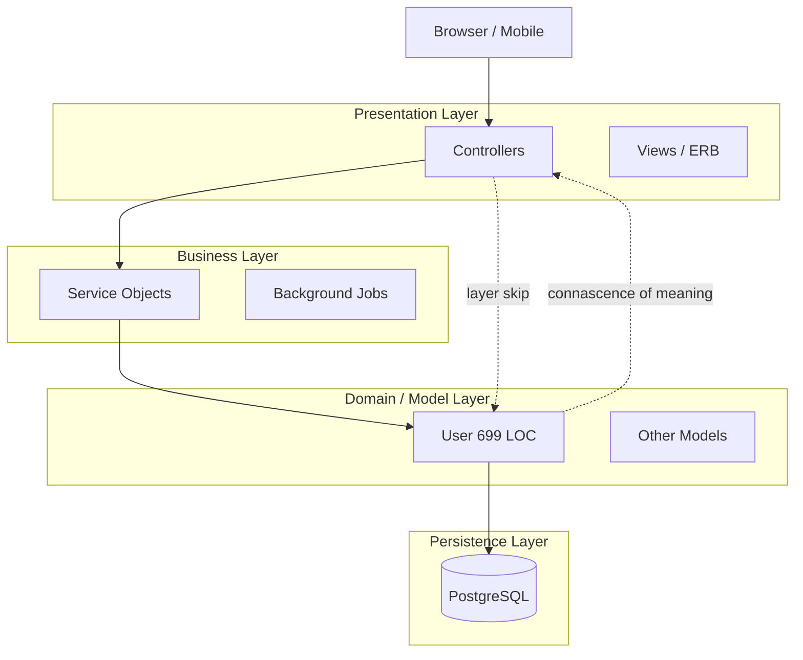
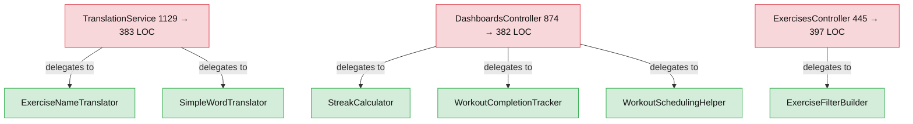
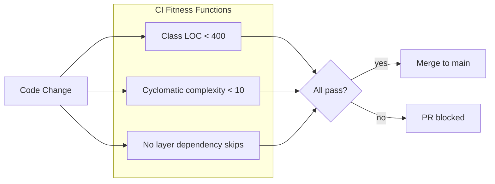

# Every Rails App Has an Architecture. Mine Just Didn't Know It Yet.

**Series:** Architecture in Practice — Book 1: Fundamentals of Software Architecture (Richards, Ford)
**Repo:** [swbook-labs](https://github.com/ozzgio/swbook-labs) · [Synergym PR #302](https://github.com/ozzgio/synergym_next/pull/302)

---

Reading about architecture characteristics while sitting next to a 874-line controller is a particular kind of uncomfortable.

The controller existed. I had not planned for it to exist. It grew there across several months of features — one action at a time, each one reasonable, the sum of them a problem. The codebase had an architecture: layered Rails monolith, single PostgreSQL instance, six background jobs. But no one had ever decided it. It accumulated.

That is what this book is about, whether it says so explicitly or not. Architecture is not what you intend. It is what you ship.

---

## The Problem

Three files in Synergym were doing work that belonged to several different classes:

- `DashboardsController` — 874 LOC. Computed weekly workout completion, streak, achievements, and scheduled upcoming days — all inside HTTP actions.
- `TranslationService` — 1129 LOC. Mixed external API calls, cache management, locale lookup, and fallback logic in one class.
- `User` model — 699 LOC. Handled OAuth callbacks, client connection management, onboarding state, unit preferences, role logic, and database associations. Fifteen `has_many` declarations. No clear responsibility boundary.

None of this was designed. Each addition made local sense at the time. The cost was distributed invisibly across every future change.

I could see the files were large. I could not explain *why* that was a problem in terms precise enough to decide what to do about it. That is where the book changed something.

---

## The Concept

Richards and Ford give architects two things: a vocabulary and a decision framework.

The vocabulary that mattered most for Synergym:

**Architecture characteristics** are not features. They are properties the system must exhibit — testability, agility, simplicity, fault tolerance, deployability. No system can optimize for all of them. The job is to choose which three actually matter for the current phase, and explicitly defer the rest.

**Connascence** is a precision instrument for coupling. Two modules are connascent when changing one requires changing the other. Connascence of meaning — role logic duplicated across controllers, policies, and views — is static and manageable. Connascence of execution — where the order that code runs matters — is dangerous at scale. The `User` model had both.

**Fitness functions** are automated tests for architecture properties, not business logic. A test that verifies `User#authenticate` works correctly is a unit test. A check that fires in CI when any controller exceeds 400 LOC is a fitness function. One tells you the behavior is correct. The other tells you the structure is still sound.

The "least worst" framing was the most useful shift. Every architecture decision is a trade-off. Optimizing for agility means accepting less fault tolerance. Choosing simplicity means deferring deployability. The book does not pretend otherwise. It teaches you to name the trade-off before you commit to the decision, not after.

---

## The Application

### Step 1 — Identify the implicit architecture

Synergym was already a layered monolith. The question was whether it should stay one. I ran the characteristics fitness profile from Chapter 4 against the current phase:

The style was right. The discipline was not. That distinction — correct style, broken discipline — is what made the layered monolith worth keeping rather than migrating away from. A service-based architecture would not have fixed a 874-line controller. It would have distributed the problem across the network.

**ADR-003** documents this as an explicit decision: Synergym stays a layered monolith until one of four named triggers is reached — Scale, Team Autonomy, Reliability Isolation, or Deployment Independence. None are close.

### Step 2 — Choose three characteristics and defer the rest

The phase-appropriate characteristics for Synergym are agility, simplicity, and testability. Not scalability. Not fault tolerance. Not deployability. Not yet.

**ADR-004** makes this explicit, with a trigger condition for each deferred characteristic. Scalability is deferred until sustained production load causes SLO misses that cannot be resolved with indexing, caching, or vertical scaling. Fault tolerance is deferred until a single subsystem failure causes unacceptable blast radius.

Before this study, these were implicit assumptions. They could not be evaluated, challenged, or handed to anyone else. After the ADR, they can be.

### Step 3 — Document the coupling debt

**ADR-005** lists every file over 400 LOC that is a known coupling risk. At the time of writing: eight files, ranging from 699 LOC (User model) to 410 LOC (Athlete::WorkoutDaysController). The ADR names the trigger conditions for each — the specific friction event that would justify decomposing it.

Documenting the debt is not the same as accepting it. It is the difference between a known architectural choice and an unknown accident.

### Step 4 — Extract the God Objects

With decisions documented, the refactoring work had a frame. The three largest files — `DashboardsController`, `TranslationService`, and `ExercisesController` — were decomposed in [PR #302](https://github.com/ozzgio/synergym_next/pull/302):

Six new classes. None of them invented — they were already there, embedded inside the larger ones. The extraction surfaced them.

### Step 5 — Make architecture violations machine-verifiable

**ADR-007** defines three fitness functions now enforced in CI:

These run on every PR that touches `app/**/*.rb`. They do not block pre-existing violations — those are documented in ADR-005 as accepted debt. They block new ones. The 874-line controller cannot be created again without an explicit, documented exception.

---

## The Result

Before this study: five large files, zero documented decisions, no automated architecture checks.

After:
- 5 ADRs written — architecture style, chosen characteristics, coupling debt, value object extraction plan, fitness functions
- 6 service objects extracted from three God Objects
- CI gate enforcing LOC, complexity, and layer dependency on every PR
- 8 files still over 400 LOC, all documented in ADR-005 with trigger conditions

The coupling debt is not gone. The User model is still 384 LOC after extracting OauthAuthenticatable, ClientConnectable, and Onboardable into separate concerns. The production monitoring module is now split into four domain sub-files but it is still one architectural concern. The work continues.

What is different is that the decisions exist. When a developer opens ADR-003 and asks why this is a monolith, there is an answer. When the CI gate blocks a PR for a 450-line class, there is a documented policy it is enforcing.

---

## The Honest Take

The book did not fix the codebase. It gave me vocabulary to describe what was already there, and a decision framework to make the implicit explicit.

The God Objects were there before I read it. The layered monolith was a default choice, not a considered one. The trade-offs I was making every day — agility over deployability, simplicity over fault tolerance — had never been named. They were the defaults that came with Rails, accepted without examination.

What the book does not solve: it gives no specific guidance for a solo developer maintaining a system they designed themselves, under changing requirements, without a team to bounce decisions off. The fitness profile exercises assume you are choosing a style, not inheriting one. Most real systems are inherited — even by their original author.

One operating rule I am carrying forward: every architectural assumption should have a named trigger that would invalidate it. Not "we will migrate to microservices someday." "We will migrate to microservices when the Reliability Isolation Trigger is reached" — defined in ADR-003. Someday is not a trigger. It is a way of never deciding.

That is what the book actually teaches. Architecture is not the diagram. It is the set of decisions that explain the diagram. Start there.
