# Connascence Hierarchy — From Safe to Dangerous

**What this shows:** The 9 types of connascence (coupling) ranked from weakest (safest, easiest to refactor) to strongest (most dangerous, hardest to change). Two families: static (visible at compile time) and dynamic (only visible at runtime).

**Key insight:** The further right a coupling type sits, the more it will hurt you when requirements change. Keep strong connascence local (inside a class or module). Never let dynamic connascence cross service boundaries.

```mermaid
flowchart LR
    subgraph STATIC["🔍 Static — visible at compile time"]
        direction LR
        CN["Name\nMethod renamed\neverywhere"] -->
        CTP["Type\nShared type\nchanges"] -->
        CM["Meaning\nMagic values\nconvention"] -->
        CP["Position\nParameter\norder"] -->
        CA["Algorithm\nShared\nalgorithm"]
    end

    subgraph DYNAMIC["⚡ Dynamic — only visible at runtime"]
        direction LR
        CE["Execution\nCall order\nmatters"] -->
        CT["Timing\nRace\nconditions"] -->
        CV["Values\nValues must\nmatch"] -->
        CI["Identity\nSame object\nrequired"]
    end

    STATIC -->|stronger →| DYNAMIC

    style CN fill:#a5d6a7,stroke:#388e3c,color:#1b5e20
    style CTP fill:#c8e6c9,stroke:#388e3c,color:#1b5e20
    style CM fill:#fff9c4,stroke:#f9a825,color:#4e342e
    style CP fill:#ffe0b2,stroke:#ef6c00,color:#3e2723
    style CA fill:#ffccbc,stroke:#d84315,color:#3e2723
    style CE fill:#ef9a9a,stroke:#c62828,color:#fff
    style CT fill:#ef5350,stroke:#b71c1c,color:#fff
    style CV fill:#e53935,stroke:#b71c1c,color:#fff
    style CI fill:#b71c1c,stroke:#7f0000,color:#fff
```

**The two rules (Jim Weirich):**
1. **Rule of Degree** — always convert a stronger form to a weaker one when you can
2. **Rule of Locality** — the further apart two components are, the weaker their connascence must be

**Synergym example:** `User` model has Connascence of Meaning (role logic duplicated as magic strings across controllers, policies, and views) — a yellow/orange risk that should become Connascence of Name via a proper `Role` value object.
