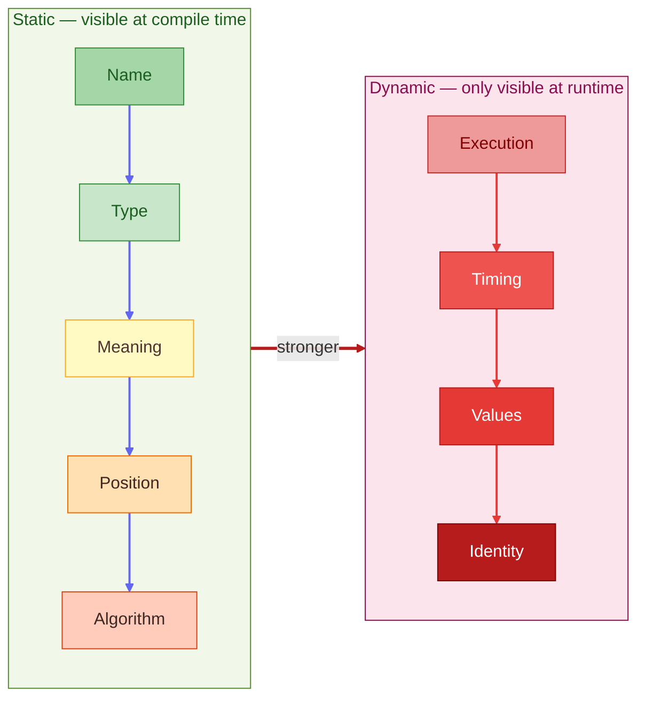

# Connascence Hierarchy — From Safe to Dangerous

**What this shows:** The 9 types of connascence (coupling) ranked from weakest (safest, easiest to refactor) to strongest (most dangerous, hardest to change). Two families: static (visible at compile time) and dynamic (only visible at runtime).

**Key insight:** The further right a coupling type sits, the more it will hurt you when requirements change. Keep strong connascence local (inside a class or module). Never let dynamic connascence cross service boundaries.

**Type breakdown:**

| Type | Family | Risk | What changes together |
|---|---|---|---|
| Name | Static | Low | Method renamed everywhere |
| Type | Static | Low | Shared type definition changes |
| Meaning | Static | Medium | Magic values / conventions |
| Position | Static | Medium-High | Parameter order |
| Algorithm | Static | High | Shared algorithm implementation |
| Execution | Dynamic | High | Call order matters |
| Timing | Dynamic | Very High | Race conditions |
| Values | Dynamic | Very High | Values must match at runtime |
| Identity | Dynamic | Extreme | Same object instance required |

**The two rules (Jim Weirich):**
1. **Rule of Degree** — always convert a stronger form to a weaker one when you can
2. **Rule of Locality** — the further apart two components are, the weaker their connascence must be

**Synergym example:** `User` model has Connascence of Meaning (role logic duplicated as magic strings across controllers, policies, and views) — a yellow/orange risk that should become Connascence of Name via a proper `Role` value object.
