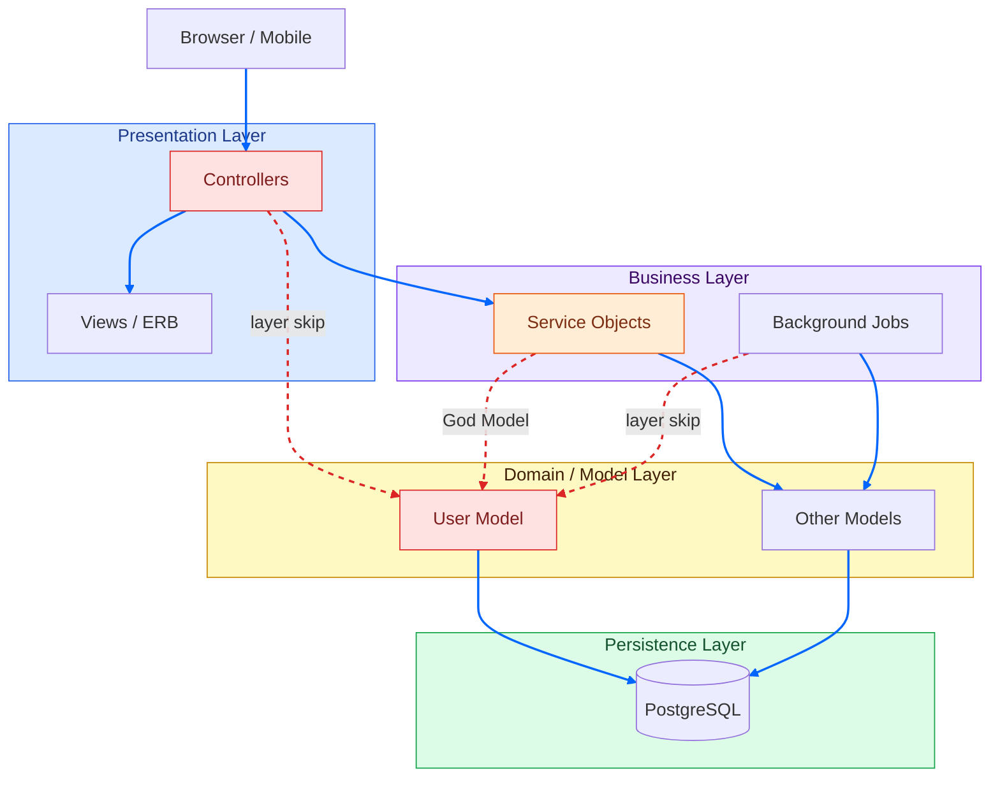

# Synergym — Layered Architecture Topology (Current State)

**What this shows:** Synergym's actual architecture as a layered monolith, with the real coupling problems surfaced. This is the "before" picture the article is built around — not a made-up example, but the real system.

**Key insight:** The architecture style is correct for the current phase. The problem is not the *style* — it's the *discipline*. God Models and fat controllers are coupling debt that doesn't require a style migration to fix.

**Layer breakdown:**

| Layer | What lives here | Coupling debt |
|---|---|---|
| Presentation | 30 controllers (avg 233 LOC), ERB views | `DashboardsController` at 874 LOC — computes streak, achievements, scheduling in one class |
| Business | 10 service objects, 6 background jobs | `TranslationService` at 1129 LOC — mixes API calls, cache, locale lookup, fallback |
| Domain / Model | 17 ActiveRecord models | `User` at 730 LOC — role logic, unit conversion, preferences all in one model |
| Persistence | Single PostgreSQL instance | No read replica, no explicit availability decision |

**Blue arrows = normal layered flow. Red dashed arrows = layer skips (coupling violations).**
The architecture is not wrong — the coupling discipline is the fix.
