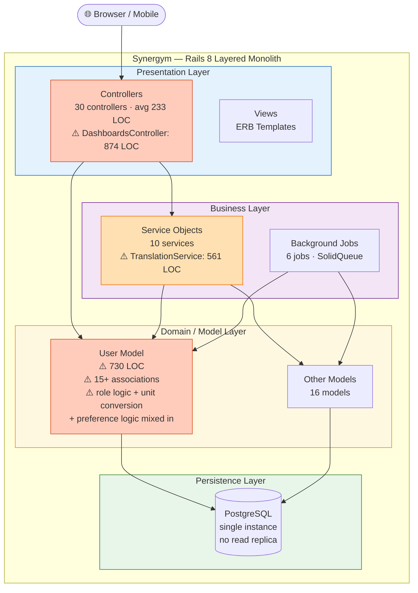

# Synergym — Layered Architecture Topology (Current State)

**What this shows:** Synergym's actual architecture as a layered monolith, with the real coupling problems surfaced. This is the "before" picture the article is built around — not a made-up example, but the real system.

**Key insight:** The architecture is correct for the current phase (solo developer, active feature development). The problem is not the *style* — it's the *discipline*. God Models and fat controllers are coupling debt that doesn't require changing the architecture style to fix.

**The ⚠️ markers are coupling debt, not architecture failures.** The layered style is the right choice. The discipline of keeping layers clean is the fix — not a style migration.

**Decisions made (from ADR-001, ADR-002):**
- Layered monolith accepted — correct for solo dev, active feature phase
- God Models accepted — with a documented extraction plan (UserPreferences value object)
- Single PostgreSQL accepted — vertical scaling is the ceiling, but we haven't hit it
