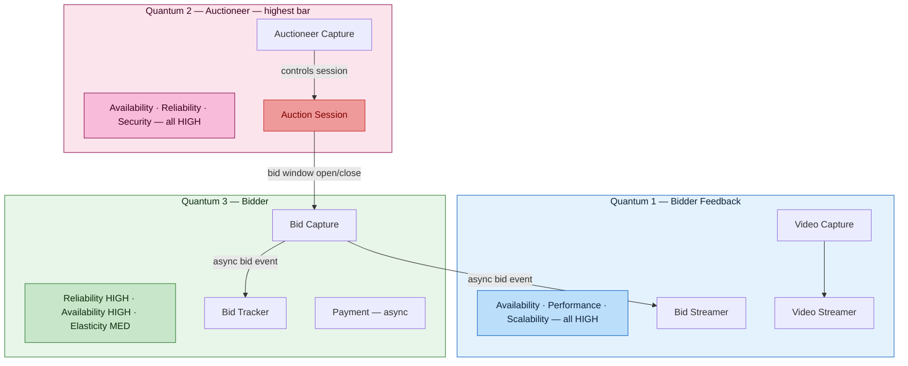

# Architecture Quantum — Going, Going, Gone Case Study

**What this shows:** Why "one set of architecture characteristics" is not always realistic. The Going, Going, Gone online auction system has three groups of users with radically different needs — each maps to a separate architecture quantum with its own characteristics profile.

**Key insight:** Before the quantum concept, an architect would try to design one system that satisfies all requirements. The quantum lens reveals that you're actually designing three different systems that happen to communicate. That changes the architecture completely.

**Quantum characteristics:**

| Quantum | Users | Key requirement | Why it's different |
|---|---|---|---|
| Q1 — Bidder Feedback | All bidders watching | Performance + scalability | Streams video and bid state to N concurrent viewers |
| Q2 — Auctioneer | One auctioneer per session | Reliability + security | Single point of failure — if auctioneer drops, the auction stops for everyone |
| Q3 — Bidder | Active bidders | Reliability + elasticity | Spikes on lot open, async payment tolerance, per-user correctness |

**Why the Auctioneer quantum has the highest bar:**
If a single bidder loses connection → one unhappy user.
If the auctioneer loses connection → the entire auction stops for everyone.
Same system, radically different availability requirements — impossible to satisfy with one architecture.

**The lesson:** Quantum analysis happens *before* you choose an architecture style. You can't pick microservices vs monolith until you know how many quanta the system has.
