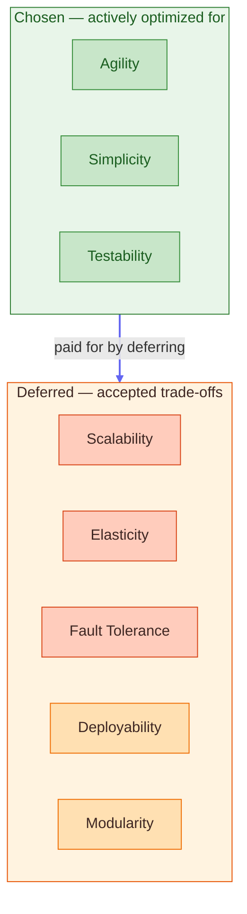

# Synergym — Architecture Characteristics Decision

**What this shows:** The explicit trade-off decision for Synergym's architecture characteristics. Three chosen, five deliberately deferred — with the cost of each deferral stated honestly. This is the artifact that didn't exist before reading the book.

**Key insight:** Every system already has architecture characteristics. The only question is whether they were *chosen* or *accumulated*. This diagram is what "choosing deliberately" looks like.

**Chosen characteristics:**

| Characteristic | How Synergym achieves it | What it buys |
|---|---|---|
| Agility | Rails conventions, monolith = local changes, no distributed overhead | Fast feature iteration for a solo developer |
| Simplicity | Single deploy, SolidQueue, SolidCache, one PostgreSQL instance | No operational complexity — no Redis, no Memcached |
| Testability | RSpec + FactoryBot, service isolation, fast local feedback loop | Confidence in refactors without integration overhead |

**Deferred characteristics:**

| Characteristic | Cost accepted | Trigger to revisit |
|---|---|---|
| Scalability | Vertical scaling only, single DB ceiling | Sustained 10k+ concurrent users |
| Elasticity | No horizontal scaling | Unpredictable traffic spikes become a problem |
| Fault Tolerance | One process = full outage | SLA requirements from clients |
| Deployability | No zero-downtime deploys | Second developer joins the team |
| Modularity | God Models accepted as known debt | UserPreferences extraction first when ready |

**The honest read:**
- Green = the system actively works toward these
- Orange = known risk, trigger defined, not a priority yet
- Red = real cost, accepted deliberately

**What changed after reading the book:** Before — these were unspoken assumptions. After — each one has a trigger condition that would cause a revisit. That's the difference between architecture that accumulated and architecture that was decided.
