# Synergym — Architecture Characteristics Decision

**What this shows:** The explicit trade-off decision for Synergym's architecture characteristics. Three chosen, five deliberately deferred — with the cost of each deferral stated honestly. This is the artifact that didn't exist before reading the book.

**Key insight:** Every system already has architecture characteristics. The only question is whether they were *chosen* or *accumulated*. This diagram is what "choosing deliberately" looks like.

```mermaid
flowchart LR
    subgraph CHOSEN["✅ Chosen — actively optimized for"]
        AGI["🚀 Agility\nRails conventions reduce friction\nMonolith = local changes\nNo distributed systems overhead"]
        SIM["⚙️ Simplicity\nSingle deploy target\nSolidQueue — no Redis\nSolidCache — no Memcached\nOne PostgreSQL instance"]
        TEST["🧪 Testability\nRSpec + FactoryBot\nComponent isolation via services\nFast local feedback loop"]
    end

    subgraph DEFERRED["❌ Deferred — accepted trade-offs"]
        SCALE["📈 Scalability\nCost: vertical only\nCeiling: single DB\nTrigger to revisit: sustained 10k+ concurrent users"]
        ELAST["🎢 Elasticity\nCost: no horizontal scaling\nTrigger: unpredictable traffic spikes"]
        FAULT["🛡️ Fault Tolerance\nCost: one process = full outage\nTrigger: SLA requirements from clients"]
        DEPLOY["🚢 Deployability\nCost: no zero-downtime deploys\nTrigger: second developer joins"]
        MOD["🧩 Modularity\nCost: God Models accepted\nPlan: UserPreferences extraction first"]
    end

    CHOSEN -- "paid for by" --> DEFERRED

    style CHOSEN fill:#e8f5e9,stroke:#2e7d32
    style DEFERRED fill:#fff3e0,stroke:#e65100
    style AGI fill:#c8e6c9,stroke:#388e3c
    style SIM fill:#c8e6c9,stroke:#388e3c
    style TEST fill:#c8e6c9,stroke:#388e3c
    style SCALE fill:#ffccbc,stroke:#d84315
    style ELAST fill:#ffccbc,stroke:#d84315
    style FAULT fill:#ffccbc,stroke:#d84315
    style DEPLOY fill:#ffe0b2,stroke:#ef6c00
    style MOD fill:#ffe0b2,stroke:#ef6c00
```

**The honest read:**
- Green = the system actively works toward these
- Orange = known risk, trigger defined, not a priority yet
- Red = real cost, accepted deliberately

**What changed after reading the book:** Before — these were unspoken assumptions. After — each one has a trigger condition that would cause a revisit. That's the difference between architecture that accumulated and architecture that was decided.
