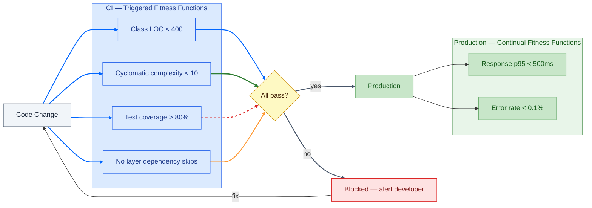

# Fitness Functions — Automated Architecture Governance

**What this shows:** Fitness functions are not unit tests — they test architecture properties, not business logic. This diagram shows how they work as a governance gate in CI, applied to Synergym's actual coupling problems.

**Key insight:** Without fitness functions, architecture characteristics drift silently. A 200 LOC controller becomes 400, then 800, and nobody notices until the damage is done. Fitness functions make the drift visible at commit time, not at code review.

**Synergym fitness function catalogue:**

| Function | Type | Characteristic protected | Current state | Target |
|---|---|---|---|---|
| Class LOC < 400 | Triggered (CI) | Modularity | `User` 730, `DashboardsController` 874 | Fail today |
| Cyclomatic complexity < 10 | Triggered (CI) | Testability | Unknown — not measured | Measure first |
| Test coverage > 80% | Triggered (CI) | Testability | Not tracked per-layer | Measure first |
| No layer dependency skips | Triggered (CI) | Modularity | `CTRL → User`, `Jobs → User` | Fail today |
| Response p95 < 500ms | Continual | Performance | Unmeasured in production | Add monitoring |
| Error rate < 0.1% | Continual | Reliability | Unmeasured | Add monitoring |

**The honest read:** Two fitness functions would fail today if Synergym ran them. That is not a failure of the architecture style — it is the coupling debt that accumulated without governance. The fix is to add the gate, watch it fail, then fix the violations one by one.
