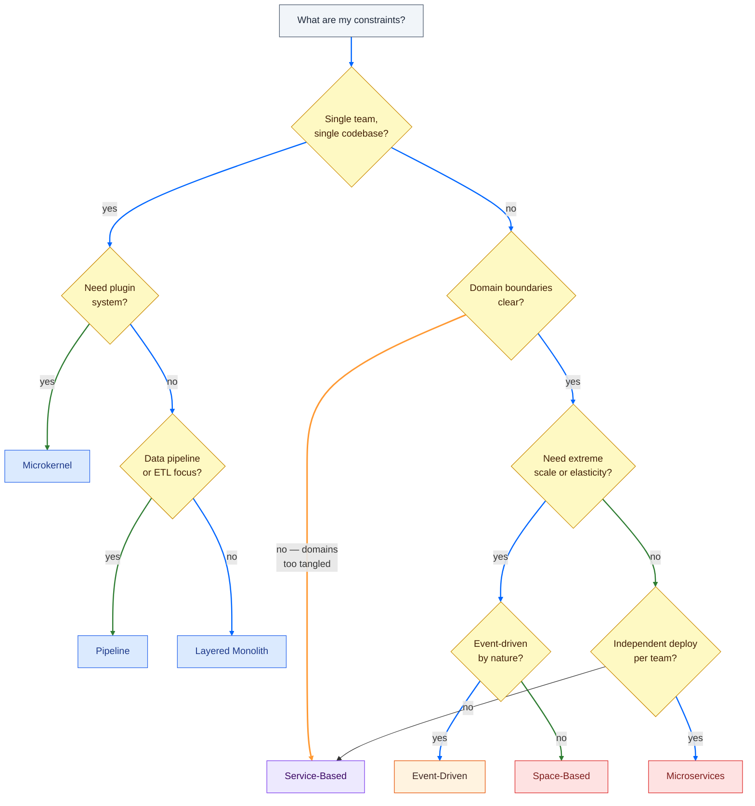

# Architecture Style Decision Tree

**What this shows:** How to choose an architecture style based on real constraints — team size, scale needs, domain complexity, deployment model. Not "what is the best style" but "what is the least-wrong style given *these* constraints."

**Key insight:** The wrong question is "which style is best?" The right question is "which style fits my current constraints?" Every style on this tree is the correct answer for someone.

**Style characteristics at a glance:**

| Style | Complexity | Scalability | Team fit | Synergym fit |
|---|---|---|---|---|
| Layered Monolith | Low | Low | 1 team, 1 deploy | **Now** — correct for current phase |
| Pipeline | Low | Low-Med | Data/ETL focus | No — wrong domain |
| Microkernel | Low-Med | Low | Plugin ecosystems | No — not a platform |
| Service-Based | Med | Med | 2-5 teams, domain split | When second team joins |
| Event-Driven | High | High | Async-first workflows | When traffic events matter |
| Space-Based | Very High | Very High | Extreme scale | Not in the foreseeable future |
| Microservices | Very High | High | Many teams, CI/CD maturity | Not in the foreseeable future |

**Where Synergym is on this tree:**
Start → Single team → No plugins → No pipeline focus → **Layered Monolith**. The tree confirms the current choice. Revisit when the team grows or a clear domain boundary emerges that forces a split.
