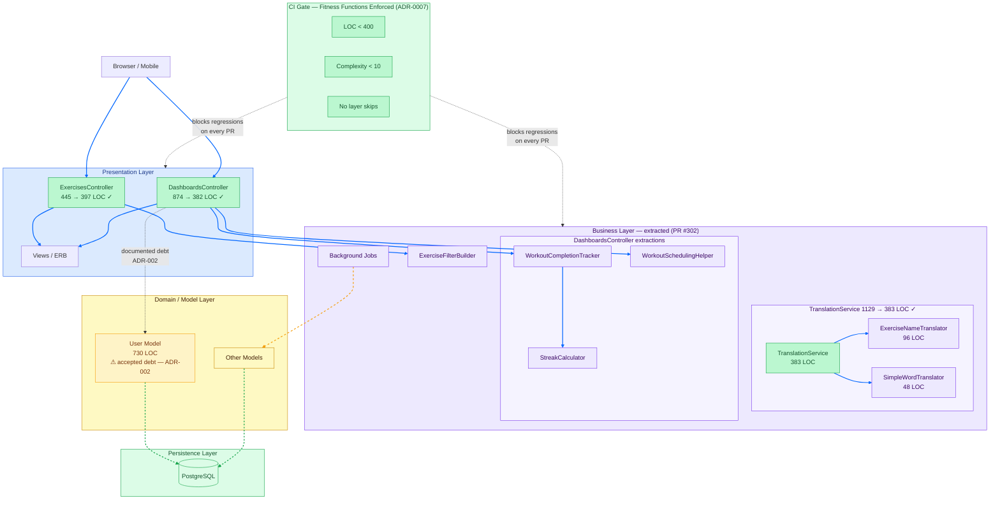

# Synergym — Layered Architecture Topology (After PR #302)

**What this shows:** Synergym's architecture after the five-module extraction — the same layered monolith, now with coupling debt paid down. Read this alongside diagram 03 (the before state): the style didn't change, the discipline did.

**Key insight:** No architecture migration needed. Five targeted extractions brought both God Objects inside the 400 LOC fitness function, removed the mixed-responsibility violations, and put an automated gate in CI to prevent regression. The remaining red node (`User`, 730 LOC) is accepted debt with a documented extraction plan — not a gap, a decision.

**What changed (before → after):**

| Component | Before | After | How |
|---|---|---|---|
| `DashboardsController` | 874 LOC 🔴 — computes streak, scheduling, completions inline | 382 LOC ✓ | Extracted `WorkoutCompletionTracker`, `StreakCalculator`, `WorkoutSchedulingHelper` |
| `TranslationService` | 1129 LOC 🔴 — API calls, cache, locale lookup, fallback mixed | 383 LOC ✓ | Extracted `ExerciseNameTranslator`, `SimpleWordTranslator` |
| `ExercisesController` | 445 LOC 🟡 | 397 LOC ✓ | Extracted `ExerciseFilterBuilder` |
| Layer skip violations | 3 red arrows (CTRL→User, SVC→User, Jobs→User) | 1 ⚠ documented (User, ADR-002) | Scope filtering + service delegation |
| Architectural governance | None — violations discovered at code review | CI fitness functions — blocked at commit | ADR-0007 + 3 automated gates |

**What did NOT change:**

- Architecture style: still layered monolith (correct — ADR-001)
- `User` model: still 730 LOC (accepted — ADR-002, extraction plan documented)
- Deployment: single NUC, single PostgreSQL (correct — ADR-001 trade-off)
- Chosen characteristics: Agility, Simplicity, Learnability — all preserved

**Blue arrows = normal layered flow. Yellow dashed = accepted debt. Green dashed = CI gate enforcement.**
