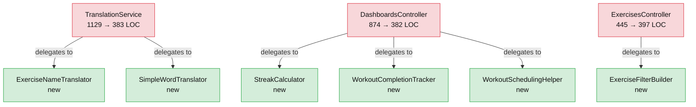

# Diagram 08 — Synergym Layered Topology: After Extraction (PR #302)

Five modules pulled out of three God Objects.
Each source class now delegates to the components extracted from it.

| Extracted from | New component | Single responsibility |
|---|---|---|
| `TranslationService` | `ExerciseNameTranslator` | EN→IT exercise names: curated overrides + rule-based compound translation |
| `TranslationService` | `SimpleWordTranslator` | Static word dictionaries (es↔en, it↔en) + movement/prefix constants |
| `DashboardsController` | `WorkoutCompletionTracker` | Completion state: session → cache → log fallback chain |
| `DashboardsController` | `StreakCalculator` | Streak computation over 90-day lookback |
| `DashboardsController` | `WorkoutSchedulingHelper` | Upcoming workout ordering with completion filtering |
| `ExercisesController` | `ExerciseFilterBuilder` | ActiveRecord scope from HTTP filter params |
