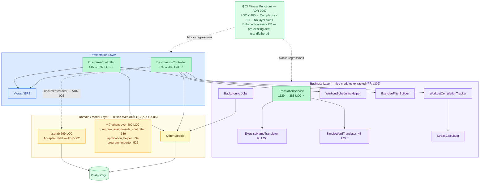

# Synergym — Layered Architecture Topology (After PR #302)

**What this shows:** The same layered monolith after the five-module extraction. Read alongside diagram 03 (before state): the style is unchanged, the coupling discipline is not.

**Key insight:** No architecture migration needed. Two targeted extractions brought `DashboardsController` (874 → 382 LOC) and `TranslationService` (1129 → 383 LOC) inside the fitness function. An automated CI gate now prevents regression. Eight pre-existing files over 400 LOC remain — they are grandfathered debt (ADR-0005), not new violations.

**What changed (before → after):**

| Component | Before | After | How |
|---|---|---|---|
| `DashboardsController` | 874 LOC — streak, scheduling, completions inline | 382 LOC ✓ | Extracted `WorkoutCompletionTracker`, `StreakCalculator`, `WorkoutSchedulingHelper` |
| `TranslationService` | 1129 LOC — API calls, cache, fallback mixed | 383 LOC ✓ | Extracted `ExerciseNameTranslator`, `SimpleWordTranslator` |
| `ExercisesController` | 445 LOC | 397 LOC ✓ | Extracted `ExerciseFilterBuilder` |
| Architectural governance | None | CI gate on every PR | 3 automated checks — ADR-0007 |

**Pre-existing debt not addressed (ADR-0005 — grandfathered, not blocked by CI):**

| File | LOC | Notes |
|---|---|---|
| `user.rb` | 699 | Accepted — extraction plan in ADR-002 |
| `trainer/program_assignments_controller.rb` | 639 | Undocumented debt |
| `application_helper.rb` | 539 | Undocumented debt |
| `program_importer.rb` | 522 | Undocumented debt |
| `workout_exercises_controller.rb` | 436 | Undocumented debt |
| `production_monitoring.rb` | 420 | Undocumented debt |
| `wger_exercise_importer.rb` | 419 | Undocumented debt |
| `athlete/workout_days_controller.rb` | 410 | Undocumented debt |

The CI gate prevents new violations from entering. It does not retroactively force fixes on pre-existing debt — that is ADR-0005's explicit decision.
