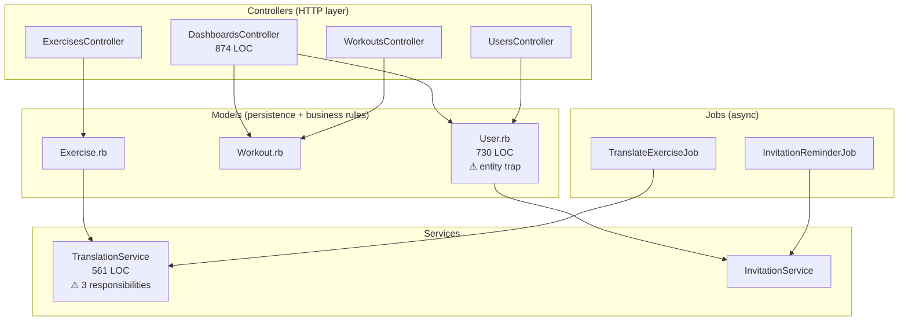
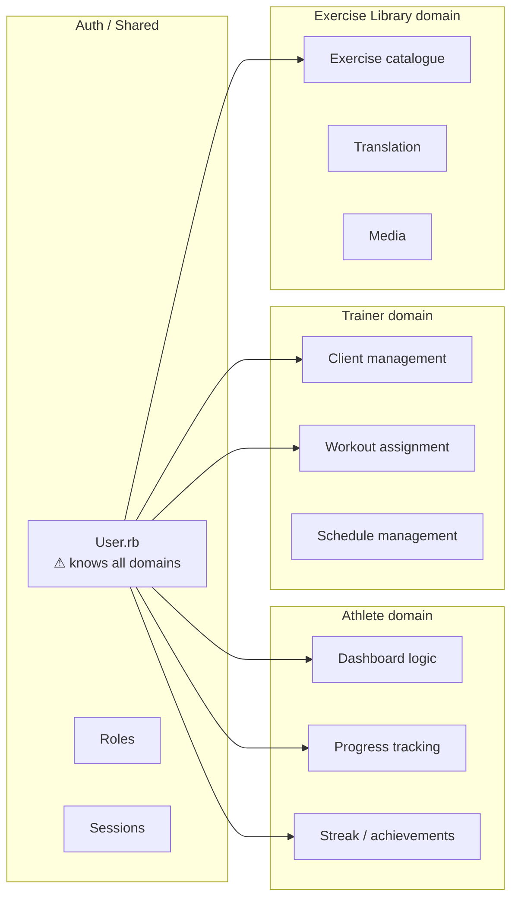

# Diagram 09 — Synergym Component Map (Current State)

Source: Ch. 8 — Component-Based Thinking

Shows the current technical partitioning of Synergym and the implicit domain
bleeding that results from the entity trap in User.rb.

## Technical layers (current partitioning)

## Implicit domains (not yet partitioned)

## Partitioning decision

Synergym uses **technical partitioning** (Rails MVC default).
This is correct for the current phase and team size (solo).

The entity trap in `User.rb` is the primary structural debt.
It is not fixed now. It is documented here as the refactor target
once the implicit domains above are explicitly named (DDD Lab 2).
