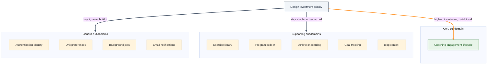

# Synergym Subdomains — Core, Supporting, Generic

**What this shows:** Where each piece of Synergym's domain logic sits on Khononov's core/supporting/generic spectrum, and what that earns or costs each one.

**Key insight for Synergym:** Only the coaching engagement lifecycle is core — the one subdomain worth real design investment. Everything else gets explicit permission to stay simple or stay bought.

**Detail table:**

| Subdomain | Type | Files today | Evidence |
|---|---|---|---|
| Coaching engagement lifecycle | Core | `program_assignment.rb` (187 LOC, 5 validations), `client_connection.rb` (181 LOC) | Only-one-active-program invariant, 14-day expiry with reminder cadence — business rules, not generic scheduling |
| Exercise library | Supporting | `exercise.rb` (357 LOC), `workout_day.rb` (295 LOC), `workout_exercise.rb` (322 LOC) | High LOC from associations and translation, not domain complexity |
| Program builder | Supporting | `program.rb` (95 LOC) | Thin rules: name required, duration positive |
| Athlete onboarding | Supporting | `onboardable.rb` concern | Multi-step but not competitive logic |
| Goal tracking | Supporting | `goal.rb` (21 LOC) | Lookup table with system defaults |
| Blog content | Supporting | `blog_post.rb` (237 LOC — overbuilt) | Standard CMS CRUD; the LOC is a code-organization warning, not domain weight |
| Authentication identity | Generic | `user.rb` (336 LOC) + Devise | Industry-standard solved problem — building it in-house is zero advantage |
| Unit preferences | Generic | `unit_system.rb` value object | Every fitness app needs this; already correctly modeled as a value object |
| Background jobs | Generic | `application_job.rb` + monitoring concern | Operational infrastructure, not business logic |
| Email notifications | Generic | ActionMailer | Sending is generic; only the trigger timing is business logic |

**Footer note:** The two core tests are simple to ask and easy to skip: would a competitor pay for this as a standalone product, and does a proven off-the-shelf solution already exist? Coaching fails the second test and passes the first. Nothing else in this map does both.
