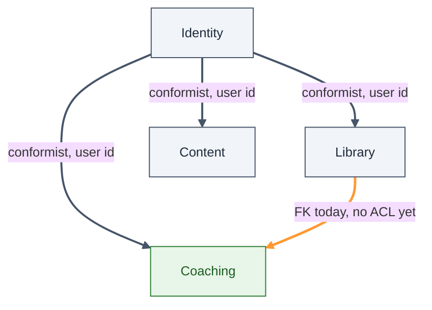

# Synergym Bounded Context Map

**What this shows:** The four bounded contexts inside Synergym's single Rails monolith, and which relationships are safe conformist couplings versus the one relationship carrying real risk.

**Key insight for Synergym:** Three of four context boundaries are conformist by design, and that's fine — Identity is meant to be depended on as-is. The Library-to-Coaching foreign key is the one relationship without a name yet, and it's the first to fail if either model changes shape.

**Detail table:**

| Context | Subdomain type | Owns | Language |
|---|---|---|---|
| Identity | Generic | `User`, OAuth, soft delete | user, credential, role |
| Coaching | Core | `ProgramAssignment`, `ClientConnection` | trainer, athlete, assignment, active, expired, paused |
| Library | Supporting | `Exercise`, `Program`, `Goal` | exercise, program, workout |
| Content | Supporting | `BlogPost` | post, draft, published |

**Footer note:** The Library-to-Coaching FK stays a conformist relationship today, not an anticorruption layer, because there are exactly two real crossing points — renaming two classes into namespaces would cost more than it currently protects. `spec/architecture/bounded_context_spec.rb` is the enforcement mechanism that watches that exact seam; see ADR-002's amendment for the full reasoning behind choosing a test over a folder.
