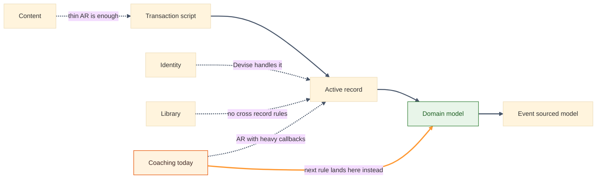

# Business Logic Pattern Spectrum — Per Context

**What this shows:** Where each Synergym context sits on the complexity spectrum from transaction script to event-sourced domain model, and which one is mid-migration.

**Key insight for Synergym:** Coaching is the only context escalating toward a domain model, and even there the migration is progressive — one command method at a time, not a rewrite. Everything else stays at active record because its invariants don't need more.

**Detail table:**

| Context | Current pattern | Target pattern | Escalation trigger |
|---|---|---|---|
| Coaching | Active record, 5 validation methods, callback-driven status | Domain model, applied progressively | Next new business rule on `ProgramAssignment` or `ClientConnection` |
| Library | Active record | Active record | Only if a cross-aggregate invariant appears |
| Identity | Active record plus Devise | Same | Not on the roadmap |
| Content | Active record, thin | Transaction script ceiling | If an editorial workflow or multi-author review is added |

**Footer note:** The migration is method-by-method, not file-by-file: the next time a rule touches `ProgramAssignment`, it becomes an explicit command method on the aggregate instead of another callback. Domain model and active record coexist in the same file until that's done — the TypeScript spike in `code/src/` is where the aggregate shape was learned first, away from the Rails AR layer.
