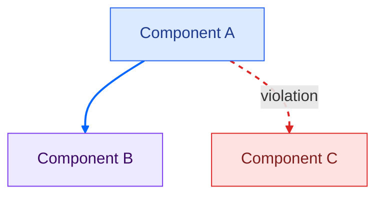

# Diagram Style Standard

Used across swbook-labs and ozzo.blog. Derived from the blog's Chakra UI theme (`libs/theme.js`).

---

## Color tokens

| Token | Hex | Use |
|---|---|---|
| Brand orange | `#ff9933` | Key insight arrow, emphasis, the main point of the diagram |
| Flow blue | `#0066ff` | Normal, expected, designed communication |
| Violation red | `#dc2626` | Layer skip, coupling violation, wrong dependency |
| Structural slate | `#475569` | Neutral connection, no semantic meaning |

These map directly to the blog: `#ff9933` is the section-underline accent, `#0066ff` is the light-mode link color.

---

## Arrow rules

Every diagram must use `linkStyle` — no default arrow colors.

| Situation | `linkStyle` value |
|---|---|
| Normal / expected flow | `stroke:#0066ff,stroke-width:2px` |
| Key insight / main point | `stroke:#ff9933,stroke-width:2.5px` |
| Violation / layer skip | `stroke:#dc2626,stroke-width:2px,stroke-dasharray:5 5` |
| Structural / neutral | `stroke:#475569,stroke-width:2px` |

---

## Node semantic fills

| Semantic role | fill | stroke | color (text) |
|---|---|---|---|
| Positive / chosen / healthy | `#e8f5e9` | `#2e7d32` | `#1b5e20` |
| Warning / debt / known risk | `#fff3e0` | `#e65100` | `#3e2723` |
| Critical / violation / danger | `#fee2e2` | `#dc2626` | `#7f1d1d` |
| Neutral / external | `#f1f5f9` | `#475569` | `#1e293b` |

### Layered architecture fills (fixed mapping)

| Layer | fill | stroke | color (text) |
|---|---|---|---|
| Presentation | `#dbeafe` | `#2563eb` | `#1e3a8a` |
| Business | `#ede9fe` | `#7c3aed` | `#3b0764` |
| Domain / Model | `#fef9c3` | `#ca8a04` | `#422006` |
| Persistence | `#dcfce7` | `#16a34a` | `#14532d` |

---

## Node text rules

- One line, maximum 4 words, no `\n` inside node labels
- No parentheses `()` in unquoted node text — GitHub's Mermaid lexer rejects them
- Metrics and detail go in the markdown table below the diagram, never inside nodes
- Shapes: `["label"]` for components, `[("label")]` for databases, `["label"]` with rounded style for external systems

---

## Layout rules

| Direction | When to use |
|---|---|
| `flowchart TD` | Hierarchy, layered architecture, top-down flows |
| `flowchart LR` | Sequences, progression, cause → effect, timelines |

Never use LR for layered architectures — layers must read top to bottom.

---

## Document structure

Every diagram file follows this template:

```
# Title

**What this shows:** one sentence.

**Key insight:** one sentence — the takeaway a reader should leave with.

```mermaid
...diagram...
```

**Detail table** — metrics and annotations that do not fit in node labels.

**Footer note** — optional call-out for the most important conclusion.
```

---

## Quick reference — copy-paste snippet


